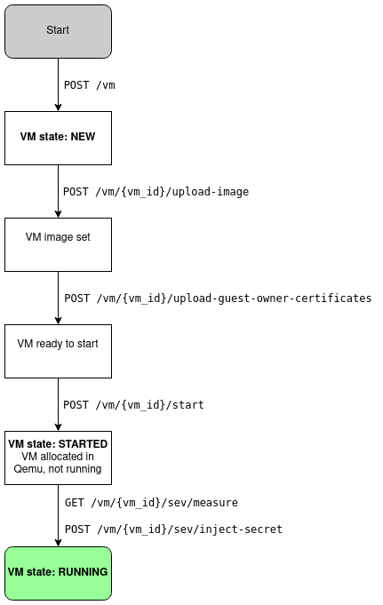
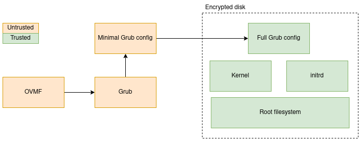

# Confidential Compute Resource Node

API and server-side tools for a prototype of confidential Compute Resource Node.

The API is basically a wrapper around AMD SEV Tool and Qemu.
It provides an interface for guest owners to interact with the AMD Security Processor
and launch VMs.

## Requirements

* The platform must support SEV.
* sevctl must be installed and available in the PATH of the platform. (see below)
* QEMU must be installed.

To install Qemu, run `tools/qemu/install_qemu.sh`. It will install a stable version
ready for use with the CRN.

### System setup

Install Libvirt
```shell
sudo apt install qemu-kvm libvirt-daemon-system libvirt-clients bridge-utils
```

Optional: Install `virtinst`
```shell
sudo apt install virtinst
```

Install requirements for Python libraries
```
sudo apt install python3-venv
# For `python-cpuid`
sudo apt install python3-dev build-essential
```

#### Install `sevctl`

Requirements:
 * `cargo`

On Ubuntu/ Debian install it via `apt install cargo` (as root)

To build and install sevctl
```cargo install  sevctl```

Ensure $HOME/.cargo/bin is in your PATH

Alternatively you can build it from git : ```cargo install  --git  https://github.com/virtee/sevctl```


## Launching the API

```shell
# Create a venv and install requirements
python3 -m virtualenv venv
source venv/bin/activate
pip install -r requirements.txt

# Run migrations
alembic upgrade head

# Start the API
python app/api.py
```

## VM lifecycle

The following diagram describes the VM life cycle as exposed through the API.



First, a user creates a VM using the `POST /vm` endpoint.
This simply notifies the API of the new VM. It will generate a UUID to identify this VM
through later API calls.
The user must then associate a disk image to the VM, and upload so-called Guest Owner certificates
to create an encrypted channel between the user and the Security Processor.

Once all the files are uploaded, the VM must be started in Qemu. The `start` endpoint does just that:
it launches an instance of Qemu in stopped mode: Qemu will allocate the RAM for the VM, load the firmware
inside it and then let the AMD Security Processor encrypt the memory.
Once this is done, the SEV endpoints allow to retrieve a measure of the memory of the VM and to
decide whether to inject a user secret in the VM. Upon secret injection, the VM is launched, i.e.
the VM CPU is started and goes through the boot sequence of the VM.

## Boot process

The following diagram describes the different pieces of the VM boot process.



* OVMF: UEFI firmware, finds the bootloader and launches it
* Grub, the bootloader, decrypts the VM image and jumps to it.
* Grub configuration files: the unencrypted script looks for the user disk decryption password injected during
  the SEV boot process, then jumps to a complete Grub configuration file provided by the user inside the VM
  image.
* Kernel + initrd + root filesystem: The OS of the VM.

OVMF and Grub must be unencrypted. This means that the VM supervisor can alter these pieces at will.
It is therefore crucial that these pieces are part of the launch measurement retrieved during the SEV
sequence.

The `tools/ovmf/build_ovmf.sh` script can be used to generate a firmware image that combines OVMF and Grub
into one binary.
